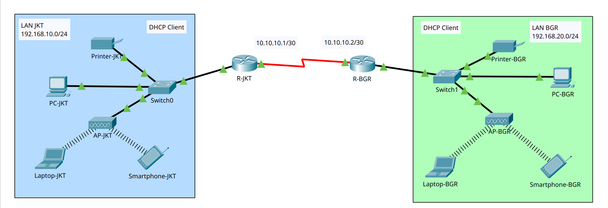

# Cisco Dynamic Routing (RIP) – WAN

## Project Description
This project is a simulation of **dynamic routing using RIP (Routing Information Protocol)** in a **WAN-based network** connecting two branch offices (**Jakarta and Bogor**) using **Cisco Packet Tracer**.

> ⓘ JKT / *Jakarta (City Code used in topology)*

> ⓘ BGR / *Bogor (City Code used in topology)*


The purpose of this project is to understand:
- WAN communication using **Serial DTE/DCE**
- Proper IP addressing for LAN and WAN
- Dynamic routing using **RIP v2**
- Inter-network communication between different locations

The network represents two offices located in different cities and connected via a leased line (WAN).

---

## Network Topology Design


---

## Network Segments

### LAN Jakarta (JKT)
- Network: **192.168.10.0/24**
- Purpose: Office LAN (PC, Printer, Wireless Devices)

### LAN Bogor (BGR)
- Network: **192.168.20.0/24**
- Purpose: Office LAN (PC, Printer, Wireless Devices)

### WAN Link (Serial)
- Network: **10.10.10.0/30**
- Purpose: Point-to-point WAN connection between routers

---

## IP Addressing Scheme

### Router R-JKT
| Interface | Description | IP Address | Subnet Mask |
|---------|------------|------------|-------------|
| Gig0/0 | LAN Jakarta | 192.168.10.1 | 255.255.255.0 |
| Se0/0/0 | WAN to R-BGR | 10.10.10.1 | 255.255.255.252 |

### Router R-BGR
| Interface | Description | IP Address | Subnet Mask |
|---------|------------|------------|-------------|
| Gig0/0 | LAN Bogor | 192.168.20.1 | 255.255.255.0 |
| Se0/1/0 | WAN to R-JKT | 10.10.10.2 | 255.255.255.252 |

---

## End Devices (Examples)

### JKT LAN
| Device | IP Address | Default Gateway |
|------|-----------|----------------|
| PC-JKT | DHCP | 192.168.10.1 |
| Printer-JKT | DHCP / Static | 192.168.10.1 |

### BGR LAN
| Device | IP Address | Default Gateway |
|------|-----------|----------------|
| PC-BGR | DHCP | 192.168.20.1 |
| Printer-BGR | DHCP / Static | 192.168.20.1 |

---

## Step-by-Step Router Configuration (Cisco CLI)

All configurations are performed using the **Cisco IOS Command Line Interface**.

---

## ==== Router R-JKT Configuration ====

### Set Router Identity
```
Router> enable
Router# configure terminal
Router(config)# hostname R-JKT
Router(config)# exit
```

### Configure LAN JKT Interface
```
R-JKT# configure terminal
R-JKT(config)# interface gig0/0
R-JKT(config-if)# ip address 192.168.10.1 255.255.255.0
R-JKT(config-if)# no shutdown
R-JKT(config-if)# exit
```


### Configure WAN Serial Interface (DCE Side)
```
R-JKT# configure terminal
R-JKT(config)# interface serial 0/0/0
R-JKT(config-if)# ip address 10.10.10.1 255.255.255.252
R-JKT(config-if)# clock rate 64000
R-JKT(config-if)# no shutdown
R-JKT(config-if)# exit
```


### Configure RIP Routing (Router JKT)
> ⓘ *The `network` command defines which directly connected networks participate in the RIP routing process.*

```
R-JKT# configure terminal
R-JKT(config)# router rip
R-JKT(config-router)# version 2
R-JKT(config-router)# no auto-summary
R-JKT(config-router)# network 192.168.10.0 
R-JKT(config-router)# network 10.10.10.0
R-JKT(config-router)# exit
```

---

## ==== Router R-BGR Configuration ====

### Set Router Identity
```
Router> enable
Router# configure terminal
Router(config)# hostname R-BGR
Router(config)# exit
```

### Configure LAN BGR Interface
```
R-BGR# configure terminal
R-BGR(config)# interface gig0/0
R-BGR(config-if)# ip address 192.168.20.1 255.255.255.0
R-BGR(config-if)# no shutdown
R-BGR(config-if)# exit
```

### Configure WAN Serial Interface
```
R-BGR# configure terminal
R-BGR(config)# interface serial 0/1/0
R-BGR(config-if)# ip address 10.10.10.2 255.255.255.252
R-BGR(config-if)# no shutdown
R-BGR(config-if)# exit
```

### Configure RIP Routing (Router BGR)
> ⓘ *The `network` command defines which directly connected networks participate in the RIP routing process.*

```
R-BGR# configure terminal
R-BGR(config)# router rip
R-BGR(config-router)# version 2
R-BGR(config-router)# no auto-summary
R-BGR(config-router)# network 192.168.20.0
R-BGR(config-router)# network 10.10.10.0
R-BGR(config-router)# exit
```

---

## Verification and Testing

### Check Routing Table
```
R-JKT# show ip route
R-BGR# show ip route
```

### Test Connectivity
```
R-JKT# ping 192.168.20.1
PC-JKT> ping 192.168.20.x
PC-BGR> ping 192.168.10.x
```

Successful replies indicate that **RIP routing is working correctly** and both LANs can communicate through the WAN link.

---

## Notes
- Each WAN link uses a **/30 subnet** for efficiency
- Static routing is intentionally avoided to demonstrate **dynamic routing behavior**

---

## Tools Used
- Cisco Packet Tracer
- Cisco IOS CLI
